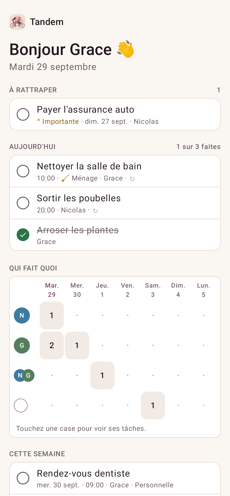
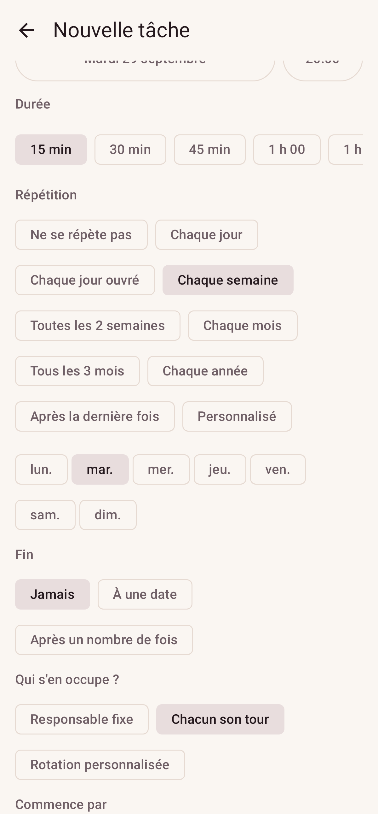
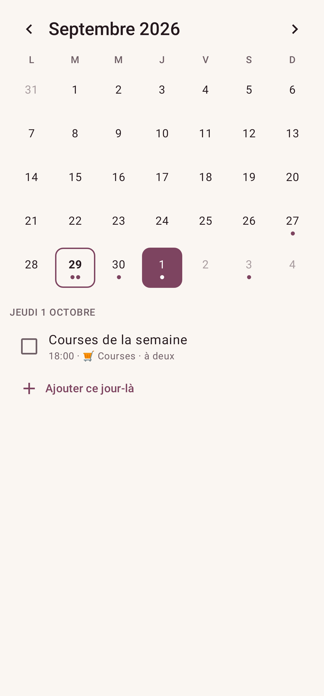
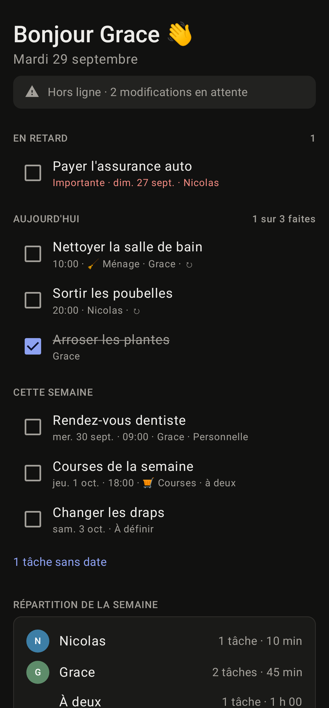

# Agenda G & N

Gestionnaire des tâches du foyer pour Grace & Nicolas : **site web responsive** et **application
Android native**, avec publication des tâches dans un calendrier Google partagé.

En production sur [agenda.fs0ciety.org](https://agenda.fs0ciety.org). Toutes les phases de la
[roadmap](docs/roadmap.md) sont livrées. Restent la recette manuelle sur téléphone (TalkBack,
Google Calendar) et la [publication Play Store](docs/play-store.md), prête côté dépôt.

<p align="center">
  
  
  
  
</p>

## Fonctionnalités

- **Aujourd'hui** : en retard, du jour, de la semaine ; répartition de la semaine (sans classement).
- **Ajout rapide en langage naturel** : « Sortir les poubelles demain 19h Grace », en français ou en anglais.
- **Échéance souple** (« Appeler le garage cette semaine ») et **report en un geste** (demain,
  ce week-end) depuis la fiche, la notification ou le widget ; **récapitulatif du matin** à 8 h.
- **Répétitions et tour de rôle** :
  - répétitions : chaque jour, jours ouvrés, semaines, mois, dernier jour du mois, personnalisées ;
  - tour de rôle : fixe, à deux, chacun son tour, rotation personnalisée, selon le jour, par semaine ;
  - aperçu des prochaines dates ;
  - modification « cette fois / les suivantes / toute la série ».
- **Liste de courses partagée** permanente, cochée à deux au magasin, hors ligne sur Android.
- **Hors ligne sur le site** comme sur Android : consultation, coches, ajout rapide et courses
  sans réseau, envoyés au retour de la connexion.
- **Temps réel** : ce que l'autre change apparaît aussitôt sur le site et dans l'app (Server-Sent Events).
- **Modèles de tâches** (« Ménage du samedi » crée toutes ses tâches d'un coup) et **historique
  « fait par »** des tâches récurrentes.
- **Commentaires sur une tâche** (« le produit est sous l'évier »), en temps réel, avec notification
  à l'autre (sans le texte), sur le site et dans l'app.
- **Mode absence** : « Grace est absente du 3 au 10 » → ses tâches partagées passent à Nicolas
  (tours de rôle compris), puis tout reprend son cours.
- **Répétition « après la dernière fois »** (détartrer, changer un filtre) : la suivante est prévue
  X jours / semaines / mois après le jour où c'est fait, avec « fait il y a 5 semaines par Grace ».
- **Ajouter par e-mail** : un e-mail transféré à son adresse personnelle devient une tâche
  (avec ses pièces jointes), confirmée par un accusé de réception.
- **Annuler** après avoir coché ou supprimé, **corbeille** de 30 jours et **journal d'activité**
  (qui a fait quoi, et quand) exportable en CSV.
- **Pièces jointes** (factures, photos) sur les tâches, sur le site et dans l'app.
- **Sous-tâches et listes** attachées à une tâche, catégories, priorités, tâches personnelles.
- **Calendrier** : vues mois, semaine et jour ; glisser-déposer (souris, doigt, clavier, TalkBack).
- **Suggestion d'attribution** : la personne la moins chargée de la semaine.
- **Google Calendar** : publication des tâches dans le calendrier partagé du foyer. Les
  déplacements et renommages faits dans Google sont repris dans l'app.
- **Notifications** : centre de notifications, préférences, rappels locaux sur Android, notifications
  instantanées (Firebase) quand l'autre vous confie une tâche.
- **Android** : hors ligne (cocher et créer sans réseau), raccourcis, dictée, mises à jour
  automatiques (APK du site) ou via Google Play, widgets « Aujourd'hui », « Semaine » et « Courses ».
- **Compte & RGPD** :
  - connexion par e-mail ou avec Google ;
  - mot de passe oublié ;
  - export JSON et suppression du compte ;
  - [politique de confidentialité](https://agenda.fs0ciety.org/privacy).
- **Accessibilité** : audit axe WCAG 2.2 AA sans violation (clair et sombre), TalkBack, mode sombre.
- **Exploitation** :
  - sauvegardes nocturnes restaurées et vérifiées, avec copie hors serveur ;
  - suivi des erreurs (Sentry / GlitchTip facultatif) ;
  - surveillance de disponibilité ;
  - Dependabot.

## Documentation

| Document                                                | Contenu                                                   |
| ------------------------------------------------------- | --------------------------------------------------------- |
| [Exigences produit](docs/product-requirements.md)       | Vision, user stories, décisions                           |
| [Architecture](docs/architecture.md)                    | Choix techniques (ADR), sécurité, RGPD, infra             |
| [Base de données](docs/database.md)                     | Modèle, récurrence, fuseaux, index                        |
| [Google Calendar](docs/google-calendar.md)              | OAuth, stratégie de synchronisation, erreurs              |
| [Vérification OAuth](docs/google-oauth-verification.md) | Faire valider l'app Google (autres foyers)                |
| [Design system](docs/design-system.md)                  | Tokens, composants, accessibilité                         |
| [Application Android](docs/android.md)                  | Hors ligne, installation, mises à jour, Firebase, recette |
| [Google Play](docs/play-store.md)                       | Publication, fiche, sécurité des données                  |
| [Tâches par e-mail](docs/email-to-task.md)              | Adresse personnelle, réception par Resend                 |
| [Déploiement](docs/deployment.md)                       | Coolify (Docker Compose) + Cloudflare, sauvegardes        |
| [Roadmap](docs/roadmap.md)                              | Phases livrées, risques                                   |

## Structure

```
apps/api       NestJS 11 + Prisma 6 (PostgreSQL 16) + BullMQ (Redis)
apps/web       Next.js 15 (App Router) + Tailwind 4 + TanStack Query + next-intl
apps/android   Kotlin + Jetpack Compose, Room, WorkManager, Glance (Gradle autonome)
  └ fastlane/metadata   Fiche Google Play (textes FR/EN, icône, captures)
packages/domain         Récurrence, rotation, ajout rapide, répartition (partagé API ↔ web)
packages/contracts      Schémas Zod partagés API ↔ web
packages/design-tokens  Tokens → CSS (web) + Tokens.kt (Android)
packages/config         tsconfig / ESLint partagés
infra/backup            Sauvegardes PostgreSQL
```

## Démarrage local

Prérequis : Node 22, pnpm 10, Docker (ou PostgreSQL 16 + Redis en local). Pour l'app mobile :
JDK 17+ et le SDK Android.

```bash
docker compose up -d                       # PostgreSQL + Redis
pnpm install
cp apps/api/.env.example apps/api/.env     # puis renseigner JWT_SECRET et TOKEN_ENCRYPTION_KEY
cp apps/web/.env.example apps/web/.env.local
pnpm --filter @agenda/api db:migrate       # applique les migrations
pnpm dev                                   # API :4000 (Swagger : /docs) · Web :3000
```

Le web appelle l'API via `/v1/*` sur sa propre origine (rewrite Next.js). Les cookies restent
first-party et il n'y a pas de CORS.

### Tests

```bash
pnpm test                               # unitaires + intégration API (base agenda_test jetable)
pnpm --filter @agenda/web e2e           # Playwright (API et web démarrés)
cd apps/android && ./gradlew lintDebug testDebugUnitTest assembleDebug
```

## Production

- **Serveur** : `docker-compose.prod.yml` sur Coolify derrière Cloudflare ;
  voir [docs/deployment.md](docs/deployment.md).
- **Android** : à chaque mise à jour de `main`, `android-release.yml` publie dans la release GitHub
  `android-latest` :
  - l'APK du site (`agenda-gn.apk`, qui se met à jour lui-même) ;
  - l'AAB Google Play (`agenda-gn-play.aab`).

  Voir [docs/android.md](docs/android.md) et [docs/play-store.md](docs/play-store.md).

### Android en développement

- `pnpm --filter @agenda/design-tokens gen:android` régénère `Tokens.kt` après modification de
  `packages/design-tokens/tokens.json`.
- En debug, l'app vise `http://10.0.2.2:4000/`, c'est-à-dire l'API locale vue depuis l'émulateur.
- Captures de la doc :
  `./gradlew testDebugUnitTest -Pscreenshots`.
- Captures du Play Store :
  `./gradlew testDebugUnitTest --tests '*StoreScreenshots*' -Pscreenshots`.
