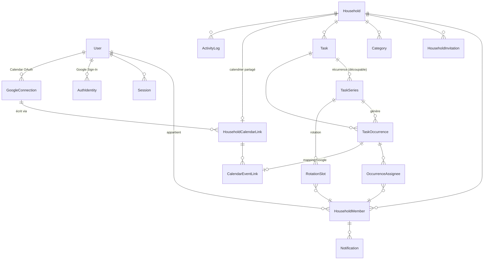

# Base de données — PostgreSQL 16 + Prisma

> Source de vérité : `apps/api/prisma/schema.prisma`. Ce document explique le *pourquoi*.

## 1. Principes

- **Multi-tenant par `householdId`** : toute donnée métier porte (directement ou dénormalisé) le `householdId` → filtres et index simples, isolation vérifiable.
- **UUID v7-like** (`uuid()` Prisma) comme identifiants : non devinables, triables approximativement par création côté client aussi (Android génère des UUID pour l'offline).
- **Dates « murales »** (ce que l'humain voit : « samedi 10:00 à Bruxelles ») stockées en `date` + minutes depuis minuit, **plus** un `startsAt timestamptz` calculé pour les requêtes par plage. Le fuseau du foyer fait autorité. Voir §5.
- **Soft delete** (`deletedAt`) sur `User`, `Household`, `Task`, `Category` — purge physique après 30 jours (RGPD). Les occurrences ne sont pas soft-deleted : elles ont un statut `CANCELLED` (c'est une donnée métier : « occurrence supprimée de la série »).
- **Concurrence optimiste** : colonne `version` sur `Task`, `TaskSeries`, `TaskOccurrence`.
- **Contraintes en base** plutôt qu'en code quand c'est possible (unicité, FK, `CHECK`).

## 2. Modèle (ERD)



## 3. Tables

### Identité
| Table | Rôle | Points clés |
|---|---|---|
| `User` | Personne | `email` unique (normalisé en minuscules), `passwordHash` nullable (compte Google uniquement), `locale` |
| `AuthIdentity` | Login fédéré (Google OIDC) | unique `(provider, providerSubject)` — on n'utilise **jamais** l'email comme clé de liaison |
| `Session` | Refresh token | `refreshTokenHash` unique (SHA‑256), `familyId` pour la détection de réutilisation, `expiresAt`, `revokedAt` |
| `PasswordResetToken` | Récupération | haché, usage unique, 30 min |

### Foyer
| Table | Rôle | Points clés |
|---|---|---|
| `Household` | Tenant | `timezone` IANA (défaut `Europe/Brussels`) |
| `HouseholdMember` | Lien user ↔ foyer | `userId` nullable : compte supprimé ⇒ membre anonymisé conservé pour l'historique partagé ; unique `(householdId, userId)`, `role` (`OWNER`/`MEMBER`), `displayName` (« Grace »), `color` (token de couleur, pas un hex libre) |
| `HouseholdInvitation` | Invitation | `tokenHash`, expiration 7 j, usage unique |
| `Category` | Catégorie configurable | unique `(householdId, name)` parmi les non supprimées, `emoji`, `position` |

### Tâches
| Table | Rôle |
|---|---|
| `Task` | La définition stable : titre, notes, catégorie, priorité, visibilité, `syncToCalendar`, créateur |
| `TaskSeries` | Règle de récurrence + paramètres temporels + rotation, valide de `startDate` à `untilDate` |
| `RotationSlot` | Qui fait quoi : `(seriesId, weekday?, position, memberId)` |
| `TaskOccurrence` | Instance datée ; porte l'état (`TODO`/`DONE`/`SKIPPED`/`CANCELLED`) |
| `OccurrenceAssignee` | Responsables d'une occurrence (0, 1 ou N) — PK `(occurrenceId, memberId)` |

Pourquoi `Task` **et** `TaskSeries` ? Pour « modifier cette occurrence et les suivantes » :
on termine la série courante (`untilDate = veille`) et on crée une **nouvelle série** sur la même
tâche. L'historique (occurrences passées, cochées) reste attaché à l'ancienne série, intact. C'est
exactement le modèle « split » de RFC 5545 / Google Calendar.

Une tâche **ponctuelle** n'a pas de série : une seule occurrence avec `seriesId = null`. Une tâche
**non planifiée** (« Appeler le plombier ») a une occurrence avec `date = null`.

### Google Calendar
| Table | Rôle |
|---|---|
| `GoogleConnection` | Autorisation OAuth calendrier d'un utilisateur : `googleSubject`, `email`, `refreshTokenEnc` (AES‑GCM), `accessTokenEnc`, `accessTokenExpiresAt`, `scopes[]`, `status` |
| `HouseholdCalendarLink` | Le calendrier partagé du foyer (unique par foyer) : `googleCalendarId`, `summary` (« Commun G & N », cache d'affichage), `accessRole`, `connectionId` |
| `CalendarEventLink` | Mapping occurrence ↔ événement : `googleEventId`, `googleCalendarId`, `etag`, `syncStatus`, `syncedVersion`, `lastSyncedAt`, `lastErrorCode`, `attempts` |

Le mapping est dans une table dédiée plutôt que des colonnes `googleCalendarEventId` sur la
tâche : une tâche récurrente a **N** événements (un par occurrence), et l'état de synchro est
propre à chaque occurrence. L'occurrence porte `syncVersion` (incrémenté à chaque changement
pertinent pour Google) : `syncedVersion < syncVersion` ⇔ travail à faire.

### Transverse
| Table | Rôle |
|---|---|
| `Notification` | Notification in-app (type, payload JSON minimal, `readAt`) |
| `NotificationPreference` | Par membre et par type : canaux (in-app, push, email), délai de rappel |
| `ActivityLog` | Journal métier (qui a coché/modifié/supprimé quoi), titre au moment de l'action, `personal` = visible par son seul auteur ; sert aussi de corbeille (restauration 30 j) — rétention 12 mois |
| `IdempotencyKey` | Rejeu sûr des requêtes Android offline — TTL 24 h |

Post‑MVP : `TaskTemplate` (modèles de tâches pré-remplis), `PushDevice` (tokens FCM).

## 4. Récurrence : représentation

`TaskSeries.rule` est un JSON **validé par Zod** (`packages/contracts`), sous‑ensemble de RRULE :

```jsonc
{ "freq": "WEEKLY", "interval": 2, "byWeekday": ["SA"] }          // toutes les 2 semaines le samedi
{ "freq": "DAILY", "interval": 1, "weekdaysOnly": true }          // jours ouvrés
{ "freq": "MONTHLY", "interval": 1, "byMonthDay": -1 }            // dernier jour du mois
{ "freq": "MONTHLY", "interval": 3, "byMonthDay": 15 }            // tous les 3 mois le 15
{ "freq": "YEARLY", "interval": 1 }                               // annuel (date de départ)
{ "freq": "AFTER", "interval": 3, "unit": "MONTH" }               // 3 mois après la dernière fois
```

**« Après la dernière fois »** (`AFTER`, jours / semaines / mois) : une seule occurrence à la fois,
à `startDate`. Quand elle est faite (ou supprimée « cette fois »), la série avance :
`startDate` = jour où c'est fait + intervalle, `rotationOffset` + 1 (tour suivant), puis
matérialisation normale. Décocher (« Annuler ») retire l'occurrence suivante encore intacte et
revient en arrière. Changer l'intervalle replace l'occurrence en attente (même identifiant) à
dernière fois + nouvel intervalle. Pas de `count`, rotation toujours `PER_OCCURRENCE`.
Les occurrences renvoient `lastDone` (dernière fois faite, et par qui) pour toute tâche récurrente.

Pourquoi JSON typé et pas la chaîne RRULE brute ? Validation stricte, sous‑ensemble maîtrisé
(pas de `BYSETPOS` exotique non testé), et conversion triviale vers RRULE si besoin.

Autres colonnes de `TaskSeries` : `startDate`, `untilDate?`, `count?`, `startMinute?` (0–1439),
`durationMinutes`, `allDay`, `rotationMode` (indication UI), `rotationAdvance`
(`PER_OCCURRENCE` | `PER_WEEK`), `rotationOffset` (continuité de la rotation après un split).

**Matérialisation** (paresseuse, avant chaque lecture, verrou consultatif par série) : occurrences générées de `startDate` jusqu'à `aujourd'hui + 90 jours`.
Unicité `(seriesId, originalDate)` → la génération est **idempotente** (`INSERT … ON CONFLICT DO NOTHING`).
`originalDate` = date prévue par la règle (équivalent de `RECURRENCE-ID`) ; `date` = date effective
(différente si l'occurrence a été déplacée). Une occurrence avec `isException = true` n'est jamais
réécrite par la régénération.

**Mode absence** (`MemberAbsence` : membre, `startDate`, `endDate` inclus) : à la génération et
au recalcul, les responsables d'une tâche **partagée** passent par `coverAbsence` (domaine) —
l'absent est retiré, et si plus personne ne reste, la tâche va au premier membre présent.
Déclarer une absence recalcule les répétitions de la période (`refreshAssignees` : responsables
seulement, identifiants et dates inchangés) et confie aux présents les tâches ponctuelles de
l'absent ; l'annuler rétablit la rotation des répétitions (les ponctuelles restent confiées).
Les tâches personnelles ne changent jamais. `HouseholdMemberDto.absentUntil` signale l'absence
en cours.

## 5. Dates, heures, fuseaux

- `date` (`DATE`) + `startMinute` (`INT`) + `durationMinutes` (`INT`) = vérité métier.
- `startsAt` / `endsAt` (`TIMESTAMPTZ`) = dérivés, calculés avec le fuseau du foyer à l'écriture, pour les requêtes de plage (vue calendrier, « en retard »).
- DST : « chaque samedi 10:00 » reste 10:00 heure locale en été comme en hiver ; `startsAt` varie de UTC+1 à UTC+2. Les heures inexistantes (passage à l'heure d'été, 02:30) sont décalées à l'heure valide suivante ; cas testés.
- Google reçoit `dateTime` local + `timeZone` IANA : Google gère le DST de son côté également.

## 6. Index principaux

| Index | Requête servie |
|---|---|
| `TaskOccurrence(householdId, date)` | Dashboard « aujourd'hui », vue calendrier |
| `TaskOccurrence(householdId, status, startsAt)` | « En retard », rappels |
| `TaskOccurrence(seriesId, originalDate)` **unique** | Idempotence de la génération |
| `OccurrenceAssignee(memberId)` | « Mes tâches » |
| `CalendarEventLink(syncStatus)` | Retry des synchros en échec |
| `CalendarEventLink(googleCalendarId, googleEventId)` **unique** | Aucun double mapping |
| `Task(householdId, deletedAt)` | Listes |
| `Session(userId)` | Déconnexion globale |
| Recherche : `Task.title` trigram (`pg_trgm`) | Recherche (post-MVP si besoin ; `ILIKE` suffit pour quelques centaines de tâches) |

## 7. Transactions

- Création d'une tâche récurrente : `Task` + `TaskSeries` + `RotationSlot` + occurrences initiales + `CalendarEventLink(PENDING)` → **une** transaction ; enqueue des jobs après commit.
- Split de série : fin de l'ancienne série, suppression des occurrences futures non-exception non terminées de l'ancienne série (leurs événements Google passent en `PENDING_DELETE`), création de la nouvelle série → **une** transaction.

## 8. Migrations

`prisma migrate dev` en local, `prisma migrate deploy` au démarrage du déploiement (étape
démarrage du conteneur API, `apps/api/docker-entrypoint.sh`). Les `CHECK` constraints et index partiels non exprimables en Prisma
sont ajoutés en SQL dans les migrations.
