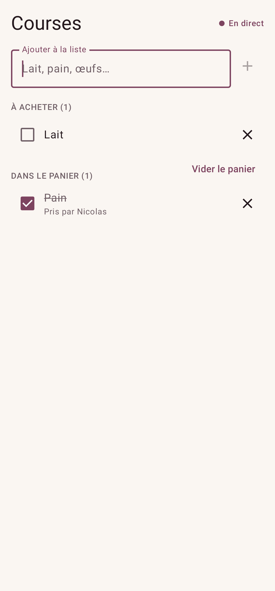

# Tandem

**L’équilibre parfait pour votre foyer.** Qui sort les poubelles, qui fait les courses, quand
détartrer la machine à café : Tandem répartit le quotidien sans compter les points, sur le
**site** ([agenda.fs0ciety.org](https://agenda.fs0ciety.org)) comme dans l'**app Android**.

## Par où commencer ?

| Vous voulez… | Lisez |
|---|---|
| Découvrir l'app, créer votre foyer, inviter l'autre | [Premiers pas](guide/premiers-pas.md) |
| Tout savoir sur une fonction précise | le **Guide** (menu de gauche) |
| Savoir ce que deviennent vos données | [Confidentialité & RGPD](rgpd.md) |
| Signaler un bug, poser une question | [Aide et signalement](guide/aide.md) |
| Voir ce qui a changé | [Nouveautés](changelog.md) |
| Installer, héberger, faire évoluer l'app | [Stack technique](stack.md), puis la section **Technique** |
| Écrire un client pour l'API | [Guide de l'API](api.md) et la [référence Swagger](/api-reference) |

## En bref

- **Aujourd'hui** : ce qui est en retard, du jour, de la semaine, et la répartition entre vous.
- **Ajout rapide** en langage naturel : « Sortir les poubelles demain 19h @Grace ».
- **Répétitions et tours de rôle** : chaque semaine, le dernier jour du mois, « chacun son tour »,
  « 6 semaines après la dernière fois »…
- **Liste de courses** partagée en temps réel, rangée par rayon, utilisable sans réseau.
- **Calendrier** (mois, semaine, jour) avec glisser-déposer, et publication dans un **Google
  Agenda** partagé.
- **Notifications** : sur le téléphone et dans le navigateur, quand l'autre vous confie une tâche.
- **Hors ligne** : le site et l'app restent utilisables sans réseau et envoient tout au retour.
- **Vie privée** : pas de publicité, pas de pistage, export et suppression de vos données en un
  clic.

L'état du service en direct est sur la page [État du service](https://agenda.fs0ciety.org/status).
